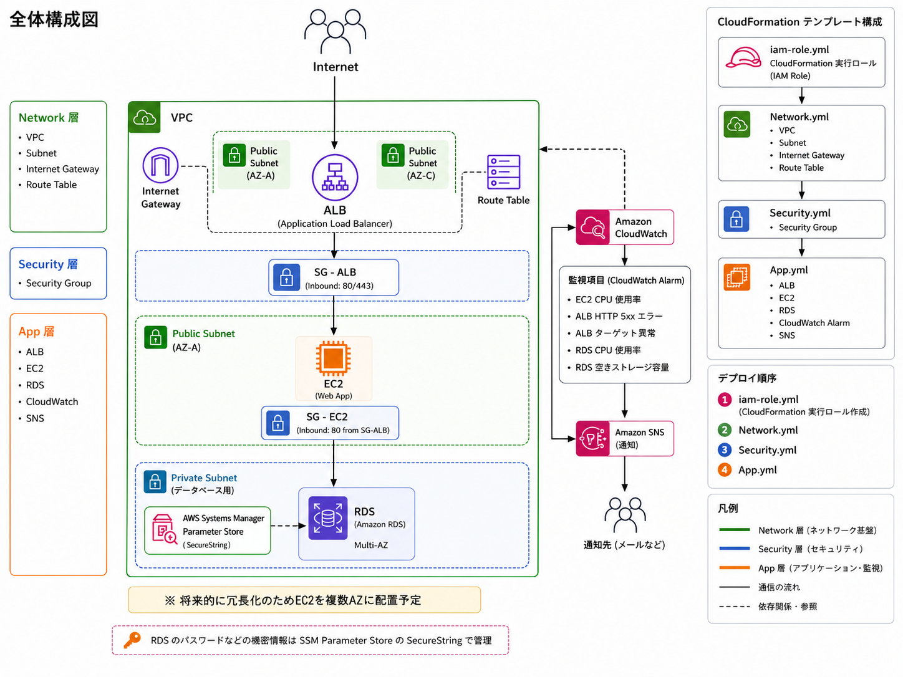

# CloudFormation AWS Portfolio

## 概要

CloudFormationを用いて、AWS上にWebアプリケーション実行環境を構築したポートフォリオです。

Network / Security / VPC Endpoint / App にテンプレートを分割し、ALB、Private EC2、RDSを用いた3層構成をコードで管理しています。

EC2はPrivate Subnetに配置し、SSHを使用せずSSM Session Managerから管理できる構成としています。
また、CloudWatchアラームとSNS通知を追加し、構築後の監視も意識しています。

## 構成



テンプレートは以下のように分割しています。

```text
AWS-CloudFormation/
├── Iam-Role.yml
├── Network.yml
├── Security.yml
├── Vpc-endpoints.yml
└── App.yml
```

## 使用技術

* AWS

  * VPC
  * Subnet
  * Internet Gateway
  * Route Table
  * Security Group
  * ALB
  * EC2
  * RDS
  * CloudWatch
  * SNS
  * IAM
  * SSM Parameter Store
* CloudFormation
* YAML
* AWS CLI

## 主な実装内容

### 1. 3層構成のAWS環境構築

CloudFormationを用いて、Network / Security / App の3層構成でAWSリソースを構築しています。   
VPC Endpointは依存関係を分離するため、専用テンプレートとして管理しています。

* Network層：VPC、Public / Private Subnet、Internet Gateway、NAT Gateway、Route Table
* Security層：Security Group    
* VPC Endpoint：SSM / EC2 Messages / SSM Messages のInterface Endpoint
* App層：ALB、EC2、RDS、CloudWatch Alarm、SNS   

テンプレートを分割することで、各レイヤーの役割を明確にしています。

### 2. Private EC2へのSSM接続

EC2をPrivate Subnetに配置し、SSHではなくSSM Session Managerを利用して接続する構成にしています。

* EC2上でSSM Agentを起動
* EC2にアタッチしたIAMロールへSSM接続に必要な権限を付与
* `ssm` / `ssmmessages` / `ec2messages` のInterface VPC Endpointを作成
* 各VPC EndpointでPrivate DNSを有効化
* VPC Endpoint用Security GroupではEC2 Security GroupからのTCP 443のみ許可

Private DNSを有効にすることで、SSM Agentが通常のAWSサービスエンドポイント名を使用したまま、VPC Endpoint経由でSystems Managerへ通信できる構成としています。

また、OSパッケージなど外部リポジトリへのOutbound通信にはNAT Gatewayを利用し、SSM関連通信はInterface VPC Endpointを経由させています。

### 3. CloudWatchアラームによる監視設定

CloudWatchアラームを設定し、AWSリソースの状態を監視できるようにしています。

監視対象の例は以下です。

* EC2のCPU使用率
* ALBのHTTP 5xxエラー
* ALBのターゲット異常
* RDSのCPU使用率
* RDSの空きストレージ容量

しきい値を超えた場合は、SNSを通じて通知できる構成にしています。

### 4. IAM実行ロールの利用

CloudFormation実行用のIAMロールを作成し、各スタック作成時に`--role-arn`で明示的に指定しています。

また、IAMポリシーでは最小権限を意識し、タグ条件や対象リソースの限定を行っています。

### 5. SSM Parameter Storeによる機密情報管理

RDSのパスワードはテンプレート内に直接記述せず、SSM Parameter StoreのSecureStringを参照する構成にしています。

これにより、機密情報をコードに含めない形でリソースを構築しています。

### 6. ChangeSetを使った安全なデプロイ確認

CloudFormationのChangeSetを利用し、スタック更新前に変更内容を確認できるようにしています。

特にRDSやEC2のような再作成が発生する可能性のあるリソースでは、`Replace`の有無を事前に確認することを意識しています。

## デプロイ順序

以下の順番でスタックを作成します。

1. `iam-role.yml`
2. `Network.yml`
3. `Security.yml` 
4. `Vpc-Endpoints.yml`
5. `App.yml`

`Iam-role.yml`でCloudFormation実行ロールを作成し、その後のスタックでは`--role-arn`を指定してデプロイします。

## 実行例

### IAMロール作成

```bash
aws cloudformation deploy \
  --template-file AWS-CloudFormation/Iam-role.yml \
  --stack-name CloudFormationExecutionRoleStack \
  --capabilities CAPABILITY_NAMED_IAM \
  --region ap-northeast-1
```

### Networkスタック作成

```bash
aws cloudformation deploy \
  --template-file AWS-CloudFormation/Network.yml \
  --stack-name AwsStudy-Network-stack \
  --capabilities CAPABILITY_NAMED_IAM \
  --role-arn arn:aws:iam::<AWSアカウントID>:role/CloudFormationExecutionRole \
  --region ap-northeast-1
```

### Securityスタック作成

```bash
aws cloudformation deploy \
  --template-file AWS-CloudFormation/Security.yml \
  --stack-name AwsStudy-Security-stack \
  --capabilities CAPABILITY_NAMED_IAM \
  --role-arn arn:aws:iam::<AWSアカウントID>:role/CloudFormationExecutionRole \
  --region ap-northeast-1
```

### Vpc-Endpointsスタック作成

```bash
aws cloudformation deploy \
  --template-file AWS-CloudFormation/Vpc-Endpoints.yml \
  --stack-name AwsStudy-Endpoints-stack \
  --capabilities CAPABILITY_NAMED_IAM \
  --role-arn arn:aws:iam::<AWSアカウントID>:role/CloudFormationExecutionRole \
  --region ap-northeast-1
```

### Appスタック作成

```bash
aws cloudformation deploy \
  --template-file AWS-CloudFormation/App.yml \
  --stack-name AwsStudy-App-stack \
  --capabilities CAPABILITY_NAMED_IAM \
  --role-arn arn:aws:iam::<AWSアカウントID>:role/CloudFormationExecutionRole \
  --region ap-northeast-1
```

## 動作確認

CloudFormationで各スタックをデプロイし、以下の動作確認を実施しました。

- SSM Session ManagerからPrivate Subnet上のEC2へ接続できることを確認
- ALB経由でEC2の8080番ポートへHTTPアクセスできることを確認
- ALB Target GroupのヘルスチェックがHealthyになることを確認
- EC2からRDS（MySQL）へ接続し、認証に成功することを確認

これにより、以下の通信経路が正常に動作することを確認しました。

Internet  
↓  
ALB  
↓  
Private EC2  
↓  
RDS  

## 工夫した点

* Network / Security / App にテンプレートを分割し、責務を明確にした
* CloudFormation実行ロールを利用し、デプロイ時の権限管理を意識した
* IAMポリシーでは最小権限を意識し、タグ条件や対象リソースの限定を行った
* RDSパスワードをSSM Parameter StoreのSecureStringで管理した
* CloudWatchアラームとSNS通知を設定し、運用監視を意識した構成にした
* ChangeSetを使い、変更内容を確認してからデプロイできるようにした
* EC2をPrivate Subnetに配置し、インターネットから直接アクセスできない構成にした
* SSM用VPC Endpointを作成し、SSHを使用せずSession ManagerでEC2を管理できるようにした
* ALB → Private EC2 → RDSの疎通確認を行い、構築した3層構成が実際に動作することを確認した

## 学んだこと

このポートフォリオを通じて、CloudFormationによるIaCの基本、AWSリソース同士の依存関係、IAM権限設計、CloudWatchによる監視設定について学びました。

特に、単にリソースを作成するだけでなく、実行ロール、機密情報管理、ChangeSet、監視設定まで含めることで、運用を意識したインフラ構成を学ぶことができました。

## 今後の改善点

* GitHub ActionsによるCloudFormationデプロイの自動化
* CloudWatch Logsを活用したログ監視
* WAFの追加
* Terraform版との構成比較
* EC2のOutbound通信を必要な通信先に限定する
